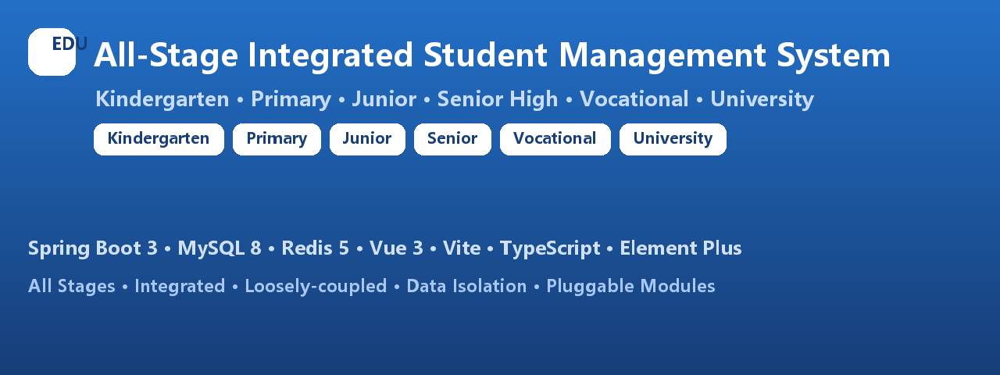

# All-Stage Integrated Student Management System



> Kindergarten → Primary → Junior → Senior High → Vocational → University. One codebase, one foundation, one permission system — adaptively rendering all educational stages.

**中文版:** [README.md](./README.md)

---

## About

An integrated student management system covering **all six educational stages** from kindergarten to university, supporting multiple schools, campuses and stages onboarding & running independently, for public / private / private-run institutions.

Built strictly against the frozen requirement spec, with a **135-table MySQL schema** mapping 1:1 to the requirements, and a "unified foundation + pluggable stage modules" architecture.

## ✨ Highlights

- 🎓 Six stages: Kindergarten / Primary / Junior / Senior High / Vocational / University
- 🏗️ Four-layer decoupled architecture: foundation / rules / business modules / presentation
- 🔐 Six-level pyramid role model: Super Admin → School Admin → Staff → Student → Parent → Visitor
- 🛡️ Strong data isolation per organization & stage; one organization binds exactly one stage
- 🧩 Pluggable modules with independent enable / circuit-break / hot-patch
- 🌐 Stage-adaptive rendering with a single frontend codebase

## 🧱 Tech Stack

| Layer | Tech | Version |
|---|---|---|
| Backend | Spring Boot / JDK | 3.3.5 / 21.0.11 |
| Database | MySQL | 8.0.45 |
| Cache / Session | Redis | 5.0.14.1 |
| ORM | MyBatis-Plus | 3.5.7 |
| Auth | Spring Security + JWT + Redis session | jjwt 0.12.6 |
| Frontend | Vue 3 + Vite + TypeScript + Pinia + Element Plus | Vite 5.4 / Vue 3.5 |

## 📦 Modules

### Platform Super Admin (sys)
Org onboarding & stage control, global dictionaries, global parameters, role permissions (menu/button/data + audit trail), operation/login/API logs, API gateway, gate hardware registry, gov reporting templates, version/hot-patch/gray release, alert center, IP allow/block lists, backup records.

### Account system (auth)
Six-level roles, JWT + Redis single-session, **five account provisioning modes** (Excel/CSV batch, class generator, ledger sync, single, email one-click confirm), dedup + partial-failure tolerance + forced first-login password change.

### Common foundation (base)
School years & terms, grades/classes (auto stage), student master, enrollment & status-change ledger, class assignment history, multi-guardian binding, staff & posts, health records (encrypted), file library.

### Common business (att/gate/msg/fin)
Student & staff attendance, leave approval (syncs absence); gate pass full audit / permissions / stranger alerts / visitors; notice publishing / read receipts / 1:1 messages / push templates; fee items / bills / payments / reductions / independent finance log.

### Stage-specific
- **Kindergarten**: pickup authorization & verification, meal publishing, naps & growth records, morning/noon checks, abnormal health loop, safety inspection rectification
- **K12**: curriculum / scheduling / teaching records / resource library, exams / scores / analysis, moral reward & class assessment, counseling, 5-dimension comprehensive evaluation
- **Senior High**: New Gaokao 3+1+2/3+3 selection rules, student choice audit & lock, tiered walking classes, grade conversion, gaokao prep ledger, graduation outcomes
- **Vocational**: majors, training sites & devices, plans & scoring, certificates, school-enterprise cooperation, internships (check-in/reports/enterprise eval), employment ledger
- **University**: departments & majors, training programs, course offers & selection (capacity check), scores & GPA, makeup/retake, academic warnings, 6-dimension comprehensive evaluation, scholarships, innovation competitions, clubs, thesis defense, degree pre-check, 4-level dormitory, repair service, employment, fitness & health

## 🚀 Quick Start

### Requirements
- JDK 21.0.11 · MySQL 8.0.45 (db `all_stage_edu`) · Redis 5.0.14.1 · Node.js v24.14.1

### Init database
Import `db/01~13` in order; optionally `db/14` for demo data (sample accounts below).

```bash
mysql -uroot -p < db/01_init_database.sql
mysql -uroot -p all_stage_edu < db/02_sys_platform.sql
# ... 03~13
mysql -uroot -p all_stage_edu < db/14_test_data.sql   # optional demo data
```

### Run backend (:8080)
```bash
cd backend && mvn -DskipTests package && java -jar target/all-stage-edu.jar
```

### Run frontend (:5173)
```bash
cd frontend && npm install && npm run dev
```

Open http://localhost:5173 (LAN devices: http://<host-ip>:5173).

### Demo accounts (password `123456`)
| Account | Role | Stage |
|---|---|---|
| superadmin | Platform Super Admin | All |
| admin_kg ~ admin_un | School Admin per stage | All six |
| t_* / s_* / p_* | Teachers / Students / Parents | All stages |

## 📁 Structure
```
├── backend/   Spring Boot (common/config/security + modules)
├── frontend/  Vue 3 (views/router/store/api/layout)
├── db/        MySQL DDL & init SQL (135-table contract, frozen)
├── assets/    GitHub banner images
└── README.dev.md / audit report
```

## 📄 License
Teaching demo / commercial delivery. DB schema & business logic strictly match the frozen requirement spec.
