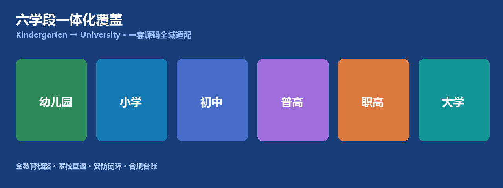
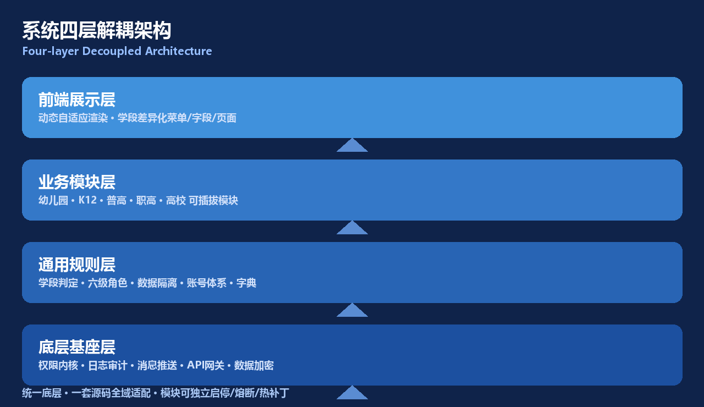
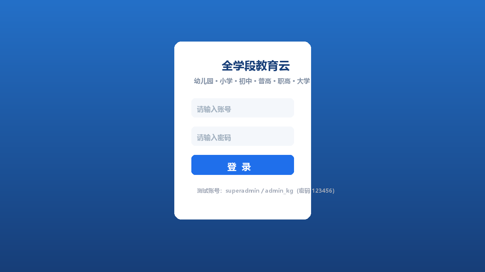
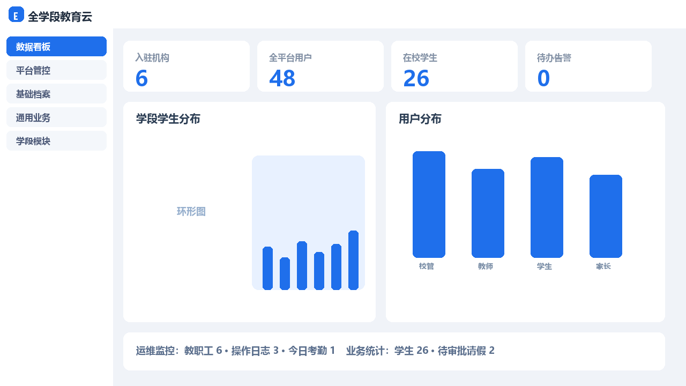
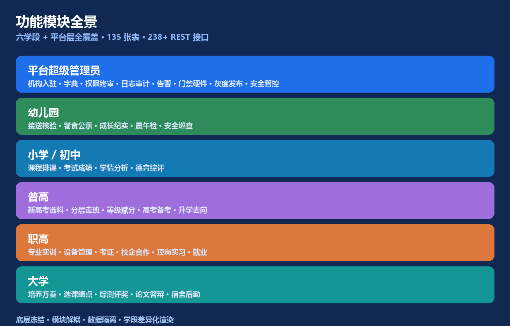

# All-Stage Integrated Student Management System


> **Kindergarten → Primary → Junior → Senior High → Vocational → University.** One codebase, one foundation, one permission system — adaptively rendering all educational stages, with multi-school, multi-campus, multi-stage onboarding.

**中文版:** [README.md](./README.md)



---

## 📋 About

A **true all-stage integrated student management system** covering the entire education chain from kindergarten to university, for public / private / private-run institutions and group / regional education bureaus.

Built strictly against the frozen requirement spec, with a **135-table MySQL schema** mapping 1:1 to the requirements, adhering to five principles: frozen foundation, pluggable modules, stage-adaptive rendering, strong data isolation, and full closed-loop coverage.

---

## 🚩 Background & Pain Points

| Market reality | This project |
|---|---|
| Fragmented single-stage systems | One codebase covering all six stages |
| Multiple systems, siloed data, high ops cost | Unified foundation + pluggable modules |
| Cross-org / cross-stage data leakage | Mandatory org-level isolation, one org = one stage |
| Outdated UI, piled-up features | Modern lightweight UI + stage-adaptive rendering |

---

## ✨ Highlights

- 🎓 Six stages: Kindergarten / Primary / Junior / Senior High / Vocational / University
- 🏗️ Four-layer decoupled architecture: foundation → rules → business modules → presentation
- 🔐 Six-level pyramid roles: Super Admin → School Admin → Staff → Student → Parent → Visitor
- 🛡️ Strong data isolation per organization & stage
- 🧩 Pluggable modules with independent enable / circuit-break / hot-patch
- 🌐 Stage-adaptive rendering with a single frontend codebase
- 🖥️ Modern ops dashboard: card layout + ECharts + real-time alerts

---

## 🏛️ Architecture



| Layer | Responsibility |
|---|---|
| **Foundation** | auth kernel, audit logs, messaging, API gateway, encryption, IP security, jobs |
| **Rules** | stage detection, six-level roles, data isolation, account system, dictionaries |
| **Business Modules** | Kindergarten, K12, Senior, Vocational, University + gate + gov (pluggable) |
| **Presentation** | dynamic menu/field/button rendering by org stage & role |

---

## 🖥️ Screenshots



*Modern lightweight login page*



*Platform dashboard: card stream layout + charts + ops monitoring*

---

## 🧩 Module Overview



### Platform Super Admin (sys)
Org onboarding & stage control, dictionaries, global params, role permissions (menu/button/data + audit), operation/login/API logs, API gateway, gate hardware registry, gov reporting templates, version/hot-patch/gray release, alert center, IP lists, backup records.

### Account system (auth)
Six-level roles, JWT + Redis single-session, **five provisioning modes** (Excel/CSV batch, class generator, ledger sync, single, email one-click confirm), dedup + partial-failure tolerance + forced first-login password change.

### Common foundation (base)
School years/terms, grades/classes (auto stage), student master, enrollment & status-change ledger, class assignment history, guardians, staff & posts, health records (encrypted), file library.

### Common business (att/gate/msg/fin)
Attendance & leave approval (syncs absence); gate pass audit / permissions / stranger alerts / visitors; notices / read-receipts / 1:1 messages / push templates; fee items / bills / payments / reductions / independent finance log.

### Stage-specific
| Stage | Core |
|---|---|
| **Kindergarten** | pickup auth & verify, meal publish, naps & growth, morning/noon checks, abnormal health loop, safety inspection |
| **K12** | curriculum, scheduling, teaching records, resource library, exams, scores, analysis, moral & class assessment, counseling, 5-dimension evaluation |
| **Senior** | New Gaokao selection rules, audit & lock, tiered walking classes, grade conversion, prep ledger, graduation outcomes |
| **Vocational** | majors, training sites & devices, plans & scoring, certificates, school-enterprise coop, internships, employment ledger |
| **University** | departments & majors, programs, offers & selection (capacity), scores & GPA, makeup/retake, warnings, 6-dim evaluation, scholarships, innovation, clubs, thesis defense, degree pre-check, dormitory, repair, employment, fitness |

---

## 🧱 Tech Stack

| Layer | Tech | Version |
|---|---|---|
| Backend | Spring Boot / JDK | 3.3.5 / 21.0.11 |
| Database | MySQL | 8.0.45 |
| Cache/Session | Redis | 5.0.14.1 |
| ORM | MyBatis-Plus | 3.5.7 |
| Auth | Spring Security + JWT + Redis | jjwt 0.12.6 |
| Frontend | Vue 3 + Vite + TypeScript + Pinia + Element Plus | Vite 5.4 / Vue 3.5 |
| Charts | ECharts | 5.5 |

---

## 🗄️ Database Contract (db/)

> 📌 **The 135-table DDL & init SQL is a FROZEN deliverable and is intentionally NOT included in this public repository** (contract security & demo-account hashes).

- **Location**: `db/` folder inside the delivery package / local workspace (`00_数据库设计说明.md` + `01~14_*.sql`, 15 files).
- **Why not in repo**: frozen schema contract, global dictionaries & demo account hashes — kept read-only and not distributed publicly by project convention.
- **How to get it**:
  1. ✅ **One-click download**: packaged as a Release asset →
     [⬇️ db-schema-v1.0.zip](https://github.com/2405646728/all-stage-edu/releases/download/v1.0.0/db-schema-v1.0.zip)
     (see **Releases** on the repo → latest v1.0.0 → asset `db-schema-v1.0.zip`)
  2. Or open an **Issue** to request it; or
  3. Get it from the delivery package / shared drive.
- **Import**: after obtaining `db/`, import in `01→14` order (see "Init database" below).

---

## 🚀 Quick Start

### Requirements
JDK 21.0.11 · MySQL 8.0.45 · Redis 5.0.14.1 · Node.js v24.14.1

### 1. Init database
> First obtain the `db/` folder from the "Database Contract" section above.

```bash
mysql -uroot -p < db/01_init_database.sql
mysql -uroot -p all_stage_edu < db/02_sys_platform.sql
# ... 03~13
mysql -uroot -p all_stage_edu < db/14_test_data.sql   # optional demo (six-stage accounts)
```

### 2. Run backend (:8080)
```bash
cd backend && mvn -DskipTests package && java -jar target/all-stage-edu.jar
```

### 3. Run frontend (:5173)
```bash
cd frontend && npm install && npm run dev
```

Open http://localhost:5173 (LAN: http://<host-ip>:5173).

### Demo accounts (password `123456`)
| Account | Role | Stage |
|---|---|---|
| `superadmin` | Platform Super Admin | All |
| `admin_kg`~ `admin_un` | School Admin per stage | All six |
| `t_*` / `s_*` / `p_*` | Teachers / Students / Parents | All stages |

---

## 📁 Structure

```
├── backend/   Spring Boot (239+ REST APIs)
├── frontend/  Vue 3 (32 pages)
├── db/        🔒 Database contract (local / delivery package, NOT in public repo)
├── assets/    GitHub banner & preview images
└── README.dev.md / audit report
```

---

## 🗺️ Roadmap

- [x] Platform foundation + auth + data isolation
- [x] Common foundation + business (attendance/gate/msg/fin)
- [x] All six-stage business modules
- [x] Modern UI + stage-adaptive rendering + ops dashboard
- [x] Five provisioning modes / file upload / CSV export / CI-ready
- [ ] Real gate hardware SDK integration
- [ ] SMS / WeChat push channels
- [ ] Production deployment (Nginx + HTTPS + env secrets)

---

## 📄 License

Teaching demo / commercial delivery. DB schema & business logic strictly match the frozen requirement spec.