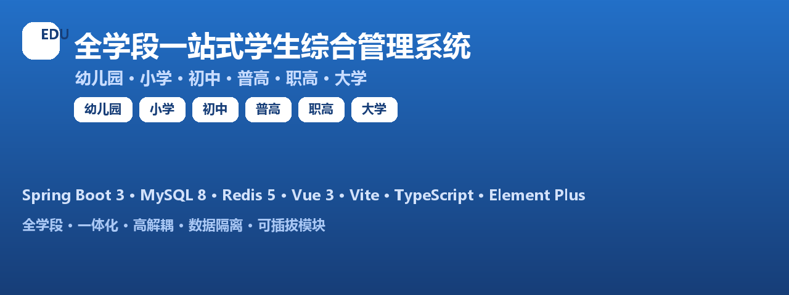

# 全学段一站式学生综合管理系统



> **幼儿园 → 小学 → 初中 → 普高 → 职高 → 大学**，一套源码、一套底层、一套权限体系，自适应全学段差异化办学场景，支持多学校、多校区、多学段同时入驻独立运行。

**English version:** [README.en.md](./README.en.md)


---

## 📋 项目简介

本项目是一套**国内首套真正意义上的全学段一体化学生综合管理系统**，从幼儿园到大学贯通全教育链路，适配**公办、民办、私立**各类办学主体，面向**集团化办学、区域教育局统一管控**场景。

系统以《全学段一站式学生综合管理系统（幼儿园-大学全覆盖｜最终定稿冻结版）》为唯一需求来源，数据库 **135 张表**与需求文档逐条一一对应，遵循「底层永久冻结、业务模块化拓展、学段差异化渲染、数据完全隔离、全场景闭环无遗漏」五大开发准则。

---

## 🚩 项目背景与痛点

| 市场现状 | 本项目方案 |
|---|---|
| 市面系统多为单一 K12 / 单一职教 / 单一高校碎片化 | 一套源码全域覆盖六学段 |
| 多套系统数据割裂、运维成本高 | 统一底层 + 模块化插件，独立启停/熔断 |
| 跨机构、跨学段数据易串 | 机构级强制隔离，单机构锁定单学段 |
| 界面老旧、功能堆砌 | 现代轻量化 UI + 学段差异化渲染 |

---

## ✨ 核心亮点

- 🎓 **六学段全覆盖**：幼儿园 / 小学 / 初中 / 普高 / 职高 / 大学
- 🏗️ **四层解耦架构**：底层基座 → 通用规则 → 业务模块 → 前端展示
- 🔐 **金字塔六级角色权限体系**：超管 → 校管 → 教职工 → 学生 → 家长 → 访客
- 🛡️ **强数据隔离**：多机构/多学段底层强制隔离，单机构固定单学段
- 🧩 **可插拔模块**：各学段功能独立封装，支持单独启停 / 熔断 / 无感热补丁
- 🌐 **学段差异化渲染**：一套前端代码动态适配六学段菜单、字段、页面
- 🖥️ **现代运维看板**：模块化卡片流式布局 + ECharts 可视化 + 实时告警

---

## 🏛️ 系统架构


### 四层分层解耦架构（全局固化）

| 层 | 职责 |
|---|---|
| **底层基座层** | 权限内核、日志审计、消息推送、API 网关、数据加密、IP 安全拦截、定时任务 |
| **通用规则层** | 学段判定、六级角色权限、数据隔离、账号体系、通用字典、文件上传 |
| **业务模块层** | 幼儿园、K12、普高、职高、高校 + 门禁硬件 + 政务对接（可插拔） |
| **前端展示层** | 依据机构学段与登录角色动态渲染菜单、字段、按钮、内容 |

---

## 🖥️ 界面预览


*现代化轻量化登录页*


*平台数据看板：卡片流式布局 + 可视化图表 + 运维监控*

---

## 🧩 功能模块全景


### 平台超级管理员（sys）
机构入驻与学段管控、全局字典、全局参数、角色权限（菜单/按钮/数据三级 + 终审留痕）、操作/登录/接口日志审计、API 网关、门禁硬件全局注册、政务上报模板、版本迭代 / 热补丁 / 灰度发布、异常告警中心、IP 黑白名单、数据备份记录。

### 账号体系（auth）
六级角色统一账号、JWT + Redis 单端会话、**五大账号开通模式**（Excel / CSV 批量、班级一键生成、台账同步、单条开通、邮箱推送一键确认），唯一查重 + 部分成功容错 + 强制首登改密。

### 通用底座（base）
学年学期、年级班级（学段自动判定）、学生主档、学籍自动建档与异动台账、分班调班历史、多监护人绑定、师资与一人多岗、健康档案（加密隔离）、统一文件库。

### 通用业务（att/gate/msg/fin）
- 学生与教职工考勤、请假审批（联动缺勤剔除）
- 门禁通行记录全量溯源 / 通行权限 / 陌生拦截红警 / 访客预约
- 通知分层发布 / 已读回执 / 一对一消息 / 推送模板
- 收费项目 / 账单生成 / 缴费入账 / 减免抵扣 / 财务独立日志（与业务日志隔离审计）

### 六学段专属
| 学段 | 核心功能 |
|---|---|
| **幼儿园** | 接送授权核验、接送记录红警、餐食公示、午休活动、成长纪实、晨午检、异常健康闭环、安全巡查整改 |
| **小学/初中** | 课程、排课调课、教学纪实、资源库、考试、成绩、学情分析、德育奖惩积分、班级量化考核、谈心心理、五维综评 |
| **普高** | 新高考 3+1+2/3+3 选科规则、学生选科审核锁定、分层走班、等级赋分、高考备考台账、升学去向 |
| **职高** | 专业、实训场地设备、实训计划与评分、职业资格考证、校企合作、顶岗实习（打卡/周月报/企业评价）、就业台账 |
| **大学** | 院系专业、培养方案、开课选课（容量校验）、成绩绩点 GPA、补考重修、学业预警、六维综测、奖学金、科创竞赛、社团、论文答辩、学位预审、宿舍四级架构、报修、就业、体测健康 |

---

## 🧱 技术栈

| 层 | 技术 | 版本 |
|---|---|---|
| 后端 | Spring Boot / JDK | 3.3.5 / 21.0.11 |
| 数据库 | MySQL | 8.0.45 |
| 缓存 / 会话 | Redis | 5.0.14.1 |
| ORM | MyBatis-Plus | 3.5.7 |
| 鉴权 | Spring Security + JWT + Redis 会话 | jjwt 0.12.6 |
| 前端 | Vue 3 + Vite + TypeScript + Pinia + Element Plus | Vite 5.4 / Vue 3.5 |
| 可视化 | ECharts | 5.5 |

---

## 🗄️ 数据库契约（db/）

> 📌 **数据库建表与初始化 SQL（135 张表契约）为冻结交付物，出于数据契约与演示安全考虑，未随本公开仓库提供。**

- **存放位置**：交付包 / 本地工作区根目录下的 `db/` 文件夹（`00_数据库设计说明.md` + `01~14_*.sql`，共 15 个文件）。
- **为什么不在仓库**：该目录包含冻结版数据库表结构、全局字典与测试账号（含演示密码哈希）等敏感契约，按项目约定保持只读且不随公开仓库分发。
- **如何获取**：
  1. ✅ **一键下载**：数据库契约已打包为 Release 附件，直接下载 →
     [⬇️ db-schema-v1.0.zip](https://github.com/2405646728/all-stage-edu/releases/download/v1.0.0/db-schema-v1.0.zip)
     （GitHub 仓库右侧 **Releases / 软件版本** → 最新版本 v1.0.0 → 附件 `db-schema-v1.0.zip`）
  2. 或在仓库 **Issues** 中提交索取申请（注明用途）；或
  3. 通过维护者提供的交付包 / 网盘同步获取。
- **导入方式**（拿到 db/ 后）：按 `01→14` 顺序导入 MySQL，见下方"初始化数据库"。

---

## 🚀 快速开始

### 环境要求
- JDK 21.0.11 · MySQL 8.0.45 · Redis 5.0.14.1 · Node.js v24.14.1

### 1. 初始化数据库
> 需先从上方"数据库契约（db/）"获取 `db/` 目录。

```bash
mysql -uroot -p < db/01_init_database.sql
mysql -uroot -p all_stage_edu < db/02_sys_platform.sql
# ... 03~13
mysql -uroot -p all_stage_edu < db/14_test_data.sql   # 可选：演示数据（含六学段账号）
```

### 2. 启动后端（:8080）
```bash
cd backend
mvn -DskipTests package
java -jar target/all-stage-edu.jar
```

### 3. 启动前端（:5173）
```bash
cd frontend
npm install
npm run dev
```

访问 http://localhost:5173（同局域网其他设备：http://<本机IP>:5173）。

### 测试账号（密码 `123456`）
| 账号 | 身份 | 学段 |
|---|---|---|
| `superadmin` | 平台超级管理员 | 全平台 |
| `admin_kg` / `admin_ps` / `admin_ms` / `admin_hs` / `admin_vs` / `admin_un` | 各学段校级管理员 | 幼儿园~大学 |
| `t_kg01` ... `t_un01` | 教师/班主任 | 各学段 |
| `s_kg001` ... `s_un102` | 学生 | 各学段 |
| `p_kg01` ... `p_un01` | 家长 | 各学段 |

---

## 📁 目录结构

```
├── backend/                Spring Boot 后端（239+ REST 接口）
│   └── src/main/java/com/asedu/
│       ├── common/         统一响应/异常/CSV导出工具
│       ├── config/         MyBatis-Plus/Redis/Security/Jackson/CORS
│       ├── security/       JWT/登录用户上下文/鉴权过滤器
│       └── sys/ auth/ base/ att/ gate/ msg/ fin/ kind/ edu/ exam/ moral/ high/ voc/ uni/
├── frontend/               Vue 3 前端（32 个页面）
│   └── src/
│       ├── api/            axios 接口模块
│       ├── views/          dashboard/platform/base/biz/kind/k12/stage
│       ├── router/ layout/ store/ types/
├── db/                     🔒 数据库契约（本地/交付包内，未随公开仓库提供）
├── assets/                 GitHub 介绍页配图
└── README_开发启动说明.md / 功能实现对照审核报告.md
```

---

## 🗺️ Roadmap

- [x] 平台底层 + 认证权限 + 数据隔离
- [x] 通用底座 + 通用业务（考勤/门禁/家校/收费）
- [x] 六学段业务模块全量落地
- [x] 现代化 UI + 学段差异化渲染 + 运维看板
- [x] 五大账号开通 / 文件上传 / 报表导出 / CI 就绪
- [ ] 真实门禁硬件协议对接（海康/中控 SDK）
- [ ] 短信/公众号推送渠道接入
- [ ] 生产部署（Nginx + HTTPS + 密钥环境变量化）

---

## 📄 许可证

本项目为教学演示 / 商用系统开发交付。数据库表结构与业务逻辑与冻结版需求文档严格对应。若用于商用，请自行进行安全审计与合规配置。